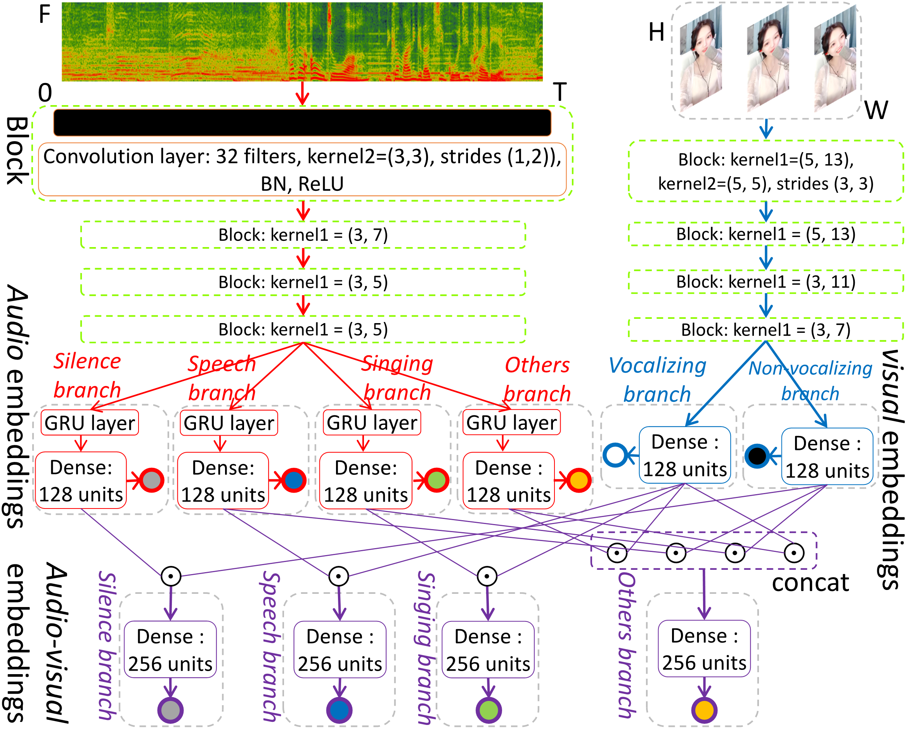
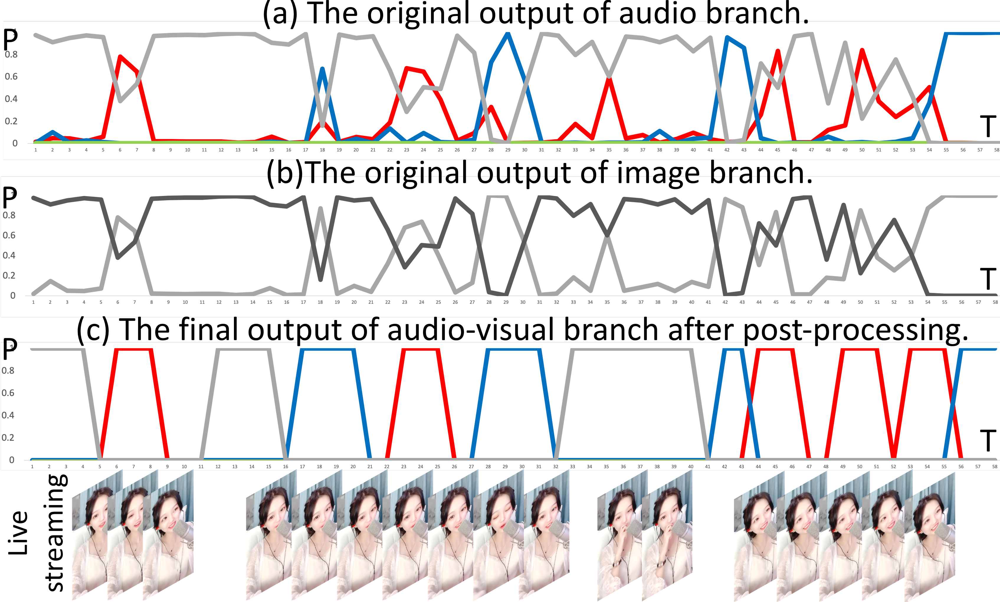

Supplementary materials for the paper: Rule-embedded network for audio-visual voice activity detection in live musical video streams , please see here for the paper: https://arxiv.org/abs/2010.14168

<h3 align="left"><a name="part3">1. The proposed rule-embedded AV-VAD network.</a>

</h3> 

 The left part is audio branch (red words) that tries to learn the high-level acoustic features of target events in audio level, and right part is image branch (blue words) attempts to judge whether the anchor is vocalizing using visual information. The bottom part is the Audio-Visual branch (purple italics), which aims to fuse the bi-modal representations to determine the probability of target events of this paper.

<h3 align="left">2. A demo from the test results.

</h3> 

In subgraph (a), the red, blue, gray and green lines denote the probability of Singing, Speech, Others and Silence in audio, respectively. 
In subgraph (b), the gray and black lines denote the probability of vocalizing and non-vocalizing, respectively. 
In subgraph (c), the red, blue and gray lines denote the probability of target Singing, Speech and Others, and the other remaining part is Silence.

<h3 align="left">3. A video demo of the detection results.

</h3> 

<video source src="Video_demos/demo2.mp4" controls="controls" width="20%"></video>

 

The font on the top left of the video shows the activity of the anchor at the current moment. The anchor speaks, it shows speech; the anchor sings, it shows singing; the anchor has no action and there is sound in the background, it shows silence; otherwise it shows others.

<h3 align="left">4. For the source code, more video demos and the open dataset MAVC100 published in this paper, please check the Code, Video_demos and Open_dataset_MAVC100 respectively.

</h3>

 

If you want to watch more intuitively, please see here: https://yuanbo2020.github.io/GitPage/.

Please feel free to contact me if you have any questions.

Mail: Yuanbo.Hou@UGent.be

