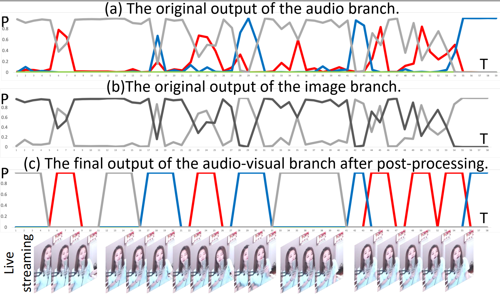

Supplementary materials for the paper: Rule-embedded network for audio-visual voice activity detection in live musical video streams , please see here for the paper: https://arxiv.org/abs/2010.14168

<p>Please see here(https://yuanbo2020.github.io/Audio-Visual-VAD/) for video demos.</p>

<h3 align="left"><a name="part3">1. The proposed rule-embedded AV-VAD network.</a><p></p></h3> 

<p><div align="center">

</div>

<p align="center"> The left part is audio branch (red words) that tries to learn the high-level acoustic features of target events in audio level, and right part is image branch (blue words) attempts to judge whether the anchor is vocalizing using visual information. The bottom part is the Audio-Visual branch (purple italics), which aims to fuse the bi-modal representations to determine the probability of target events of this paper.</p>

</p>

<h3 align="left">2. The original output of the rule-embedded AV-VAD network.<p></p></h3> 

<p><div align="center">

</div>
</p>

<p align="center">In subgraph (a), the red, blue, gray and green lines denote the probability of Singing, Speech, Others and Silence in audio, respectively.<br>
In subgraph (b), the gray and black lines denote the probability of vocalizing and non-vocalizing, respectively.<br>
In subgraph (c), the red, blue and gray lines denote the probability of target Singing, Speech and Others, and the other remaining part is Silence.</p>

<h3 align="left">3. For the source code, video demos and the open dataset MAVC100 published in this paper, please check the Code, Video_demos and Open_dataset_MAVC100, respectively.<p></p></h3>

<p>If you want to watch more intuitively, please see here: https://yuanbo2020.github.io/Audio-Visual-VAD/.</p>

# Citation
Please feel free to use the open dataset MAVC100 and consider citing our paper as

```bibtex
@inproceedings{icassp2021_hou,
  author    = {Yuanbo Hou and
               Yi Deng and
               Bilei Zhu and
               Zejun Ma and
               Dick Botteldooren},
  title     = {Rule-embedded network for audio-visual voice activity detection in
               live musical video streams},
  booktitle = {{IEEE} International Conference on Acoustics, Speech and Signal Processing,
               {ICASSP} 2021},
  publisher = {{IEEE}},
  year      = {2021},
}
```
